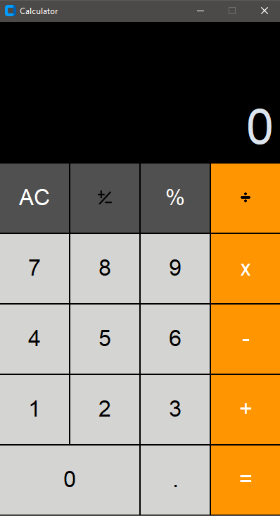

# Mini-Projects

Basic Tkinter Calculator
This is a simple calculator application built using the Tkinter library in Python. It allows users to perform basic arithmetic operations such as addition, subtraction, multiplication, and division. The user interface is created using Tkinter's graphical components, making it easy to understand and use.

Features
Addition, subtraction, multiplication, and division operations.
Clear button to reset the input and result.
Responsive and user-friendly graphical user interface.
Prerequisites
Make sure you have Python installed on your machine. This application uses the Tkinter library, which is included in the standard library of Python.

Installation
Clone or download this repository to your local machine.

git clone https://github.com/AlexMilenkov1/Mini-Projects/tree/main/calculator

Navigate to the project directory.

cd calculator

Run the calculator application.

python calculator.py

Usage
Enter the numbers you want to perform calculations on using the number buttons.
Click on the operation buttons (+, -, *, /) to choose the desired operation.
Click on the equal (=) button to display the result.
To clear the input and result, click the Clear button(AC).

Screenshots

Contributing
Contributions are welcome! If you find any bugs or want to improve the application, feel free to open an issue or submit a pull request. Make sure to follow the code of conduct.

License
This project is licensed under the MIT License.

Acknowledgments
This project was inspired by the desire to create a simple yet functional Tkinter application.
Thanks to the Python community and the Tkinter developers for providing the tools and resources needed to create this application.
